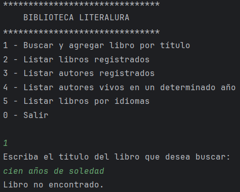
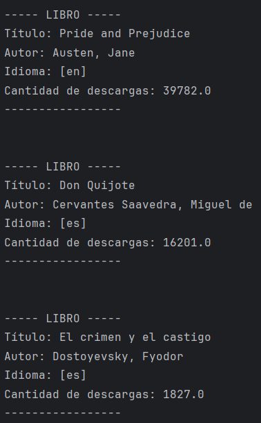
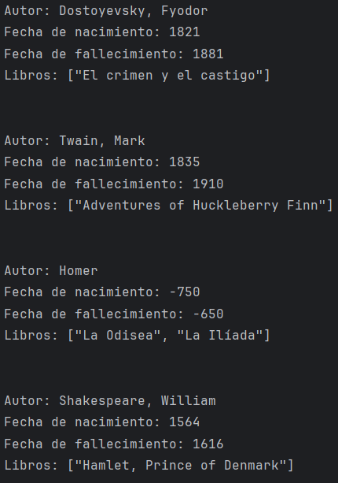
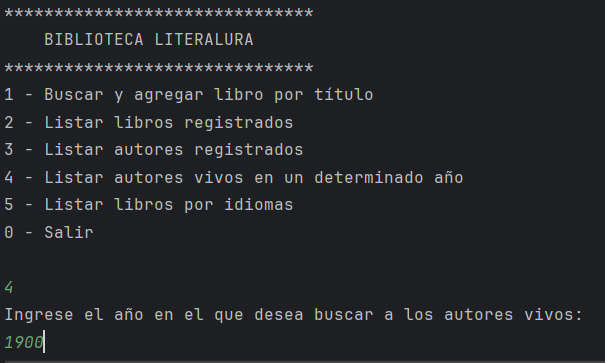
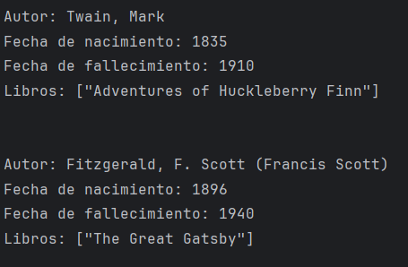
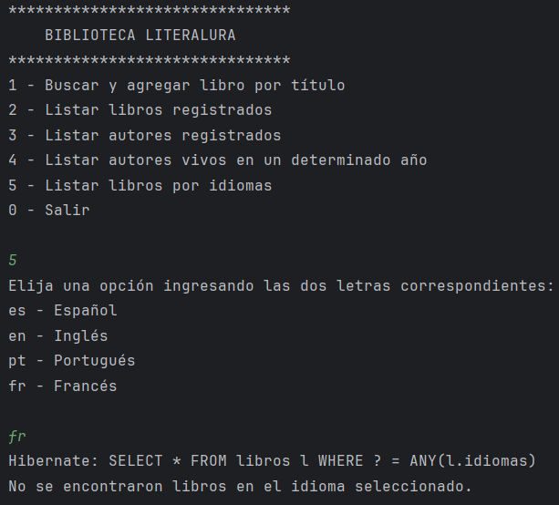

# Biblioteca Literalura - Aplicación de Gestión de Libros y Autores

Esta aplicación permite gestionar libros y autores obtenidos desde la API pública [Gutendex](https://gutendex.com/books/). Ofrece opciones para buscar libros, listar información y realizar consultas avanzadas, como autores vivos en un año específico o libros por idioma.

## Tabla de Contenidos

1. [Descripción General](#descripción-general)
2. [Programas utilizados](#programas-utilizados)
3. [Ejecución de la Aplicación](#ejecución-de-la-aplicación)
4. [Opciones del Menú](#opciones-del-menú)
5. [Detalles Técnicos](#detalles-técnicos)
6. [Ejemplo de Resultados](#ejemplo-de-resultados)

---

## Descripción General

La aplicación permite:
- Buscar libros por título y agregar los resultados a la base de datos.
- Listar libros y autores almacenados.
- Consultar autores que estaban vivos en un año específico.
- Filtrar libros por idioma.

Utiliza:
- **Spring Boot** para la lógica de back-end.
- **JPA** y **Hibernate** para la gestión de la base de datos.
- **HttpClient** para consumir la API de Gutendex.
- **Jackson** para la conversión de JSON a objetos Java.

---

## Programas utilizados

- Java 21.
- IntelliJ IDEA como IDE.
- Una base de datos compatible con **PostgreSQL**.
- Dependencias gestionadas con **Maven**.

---

## Ejecución de la aplicación

Al iniciar la aplicación, se mostrará un menú con las siguientes opciones:

1 - Buscar y agregar libro
2 - Listar libros
3 - Listar autores
4 - Listar autores por año
5 - Listar libros por idiomas
0 - Salir

## Opciones del menú
#### 1. Buscar y agregar libro
- Solicita al usuario el título de un libro.
- Consulta la API de Gutendex para obtener los datos del libro y su autor.
- Si el libro ya existe en la base de datos, muestra un mensaje indicando que ya está almacenado.
- Si el autor no existe, lo reemplaza con un guión.
```
private void buscarYAgregrarLibro() {
        Optional<DatosLibro> datos = getDatosLibro();
        if (datos.isPresent()) {
            DatosLibro datosLibro = datos.get();
            //Buscar si el libro ya está registrado
            if (libroRepository.existsByTitulo(datosLibro.titulo())) {
                Libro libro = libroRepository.findByTitulo(datosLibro.titulo());
                System.out.println("El libro ya se encuentra registrado en la base de datos.");
                System.out.println(libro);
                return;
            }
            //Agregar al autor si no está registrado
            Autor autor;
            if (!datosLibro.autor().isEmpty()) {
                DatosAutor datosAutor = datosLibro.autor().get(0);
                autor = autorRepository.findByNombre(datosAutor.nombre())
                        .orElseGet(() -> {
                            Autor nuevoAutor = new Autor(datosAutor);
                            return autorRepository.save(nuevoAutor);
                        });
            } else {
                autor = null;
            }


            //Registrar libro
            Libro libro = new Libro(datosLibro);
            libro.setAutor(autor);
            libroRepository.save(libro);
            System.out.println("Libro agregado a la base de datos:");
            System.out.println(libro);
        } else {
            System.out.println("Libro no encontrado.");
        }
    }
```

#### 2. Listar libros
- Muestra todos los libros almacenados en la base de datos.
```
private void listarLibros() {
        List<Libro> libros = libroRepository.findAll();
        libros.stream()
                .forEach(System.out::println);
    }
```

#### 3. Listar autores
- Muestra todos los autores almacenados en la base de datos con su información básica y títulos de libros.
```
private void listarAutores() {
        List<Autor> autores = autorRepository.findAll();
        autores.stream()
                .forEach(System.out::println);
    }
```

#### 4. Listar autores por año
- Solicita un año e imprime todos los autores que estaban vivos en ese año.
- Considera las fechas de nacimiento y fallecimiento.
```
private void listarAutoresPorAnio() {
        System.out.println("Ingrese el año en el que desea buscar a los autores vivos: ");
        var anio = teclado.nextInt();
        teclado.nextLine();
        List<Autor> autoresVivos = autorRepository.findByAnio(anio);
        if (!autoresVivos.isEmpty()) {
            autoresVivos.forEach(System.out::println);
        } else {
            System.out.println("No se encontraron autores vivos en el año " + anio);
        }
    }
```

#### 4. Listar libros por idioma
- Solicita un idioma y devuelve los libros que tienen ese idioma en su propiedad idiomas.
```
private void listarLibrosPorIdiomas() {
        System.out.println("""
                Elija una opción ingresando las dos letras correspondientes:
                es - Español
                en - Inglés
                pt - Portugués
                fr - Francés
                """);
        var idioma = teclado.nextLine();
        List<Libro> libros = libroRepository.findLibrosByIdioma(idioma.toLowerCase());
        if (!libros.isEmpty()) {
            libros.forEach(System.out::println);
        } else {
            System.out.println("No se encontraron libros en el idioma seleccionado.");
        }
    }
```

## Detalles técnicos
#### Consumo de la API
El consumo de datos desde Gutendex se realiza a través de HttpClient:
```
public String obtenerDatos(String url) {
    HttpClient client = HttpClient.newHttpClient();
    HttpRequest request = HttpRequest.newBuilder()
            .uri(URI.create(url))
            .build();
    try {
        HttpResponse<String> response = client.send(request, HttpResponse.BodyHandlers.ofString());
        return response.body();
    } catch (IOException | InterruptedException e) {
        throw new RuntimeException(e);
    }
}
```
#### Conversión de datos JSON
Se utiliza ObjectMapper de Jackson para convertir JSON a objetos:
```
public <T> T obtenerDatos(String json, Class<T> clase) {
    try {
        return objectMapper.readValue(json, clase);
    } catch (JsonProcessingException e) {
        throw new RuntimeException(e);
    }
}
```

## Ejemplo de resultados
#### Intentar registrar libro:

#### Listar libros registrados:

#### Listar autores registrados:

#### Listar autores vivos en determinado año:


#### Listar libros por idioma si están registrados:
